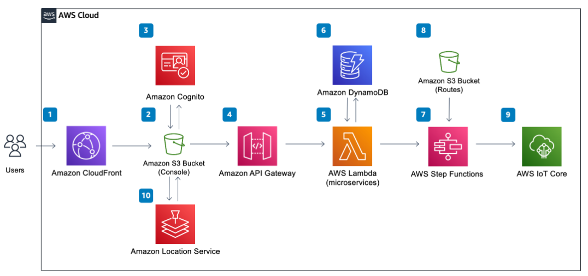

# Iot Simulator

Use cases for this AWS Solution:
> Improve remote device management with connected tools and scaled communication. Electronic product companies must securely onboard, organize, and monitor connected products. Once these products are deployed in the field, these companies must also manage remotely updating and scaling devices to meet workload requirements. Remote Device Management solutions on AWS easily connect devices or device fleets to the cloud. Once connected to the cloud, companies can remotely manage devices and scale communication between devices to enhance operations.

[IoT Device Simulator](https://aws.amazon.com/solutions/implementations/iot-device-simulator/)

> The IoT Device Simulator solution helps customers test device integration and improve performance of their IoT backend services, via an intuitive web-based graphical user interface (GUI). The solution allows customers to create and simulate hundreds of connected devices, without having to configure and manage physical devices, or develop time-consuming scripts.

### Reference

- [How to Run 1000s of AWS Lambda functions each minute](https://medium.com/@klishch/how-to-run-1000s-of-aws-lambda-functions-each-minute-1658cedec7d2)
- [Device Simulation with AWS IoT and AWS Lambda](https://aws.amazon.com/blogs/iot/device-simulation-with-aws-iot-and-aws-lambda/)